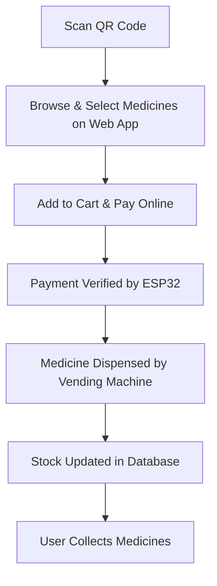
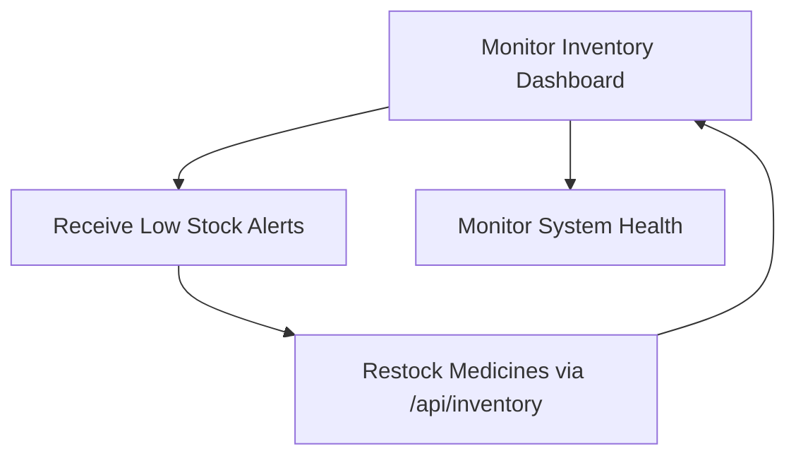

# MediVend: IoT-Based Smart Medical Vending Machine

## Overview

MediVend is an IoT-powered, touchless medical vending machine that enables users to quickly and hygienically purchase medicines. Simply scan a QR code, select medicines on a mobile-friendly site, pay digitally, and collect your medicines—all controlled in real-time via ESP32, Arduino, and IoT APIs.

---

## Problem & Solution

### The Problem
- Limited 24/7 access to essential medicines, especially in rural or remote areas.
- Manual counters cause delays, hygiene concerns, and inefficient stock management.

### Our Solution
- A QR-based, contactless medicine vending machine with a web interface for browsing, selection, and digital payment.
- Automated dispensing using ESP32 and Arduino-controlled servo motors.
- Real-time inventory tracking and automated admin notifications for restocking.

---

## System Workflow

### User Workflow

### Admin Workflow

---

## Technology Stack

- **Frontend:** HTML, CSS, JavaScript (mobile-optimized web app)
- **Backend / IoT:** ESP32 (using the Arduino framework, WebServer library)
- **Hardware:** Arduino, Servo Motors, IR Sensors, LEDs, Buzzer
- **Database:** EEPROM on ESP32 for persistent inventory
- **APIs:** REST APIs hosted on ESP32

---

## Hardware Requirements

- **ESP32 Board:** DevKit C or similar (min. 520KB RAM, 4MB Flash)
- **10x Servo Motors** for dispensing
- **Buzzer, LEDs, IR Sensors** for feedback and detection
- **Power Supply:** 12V/5A for servos, 5V/2A for ESP32
- **Miscellaneous:** Breadboard/PCB, jumper wires, resistors

---

## Future Enhancements

- Aadhaar-based user authentication
- Doctor’s e-prescription verification
- Solar power for off-grid deployments

---

